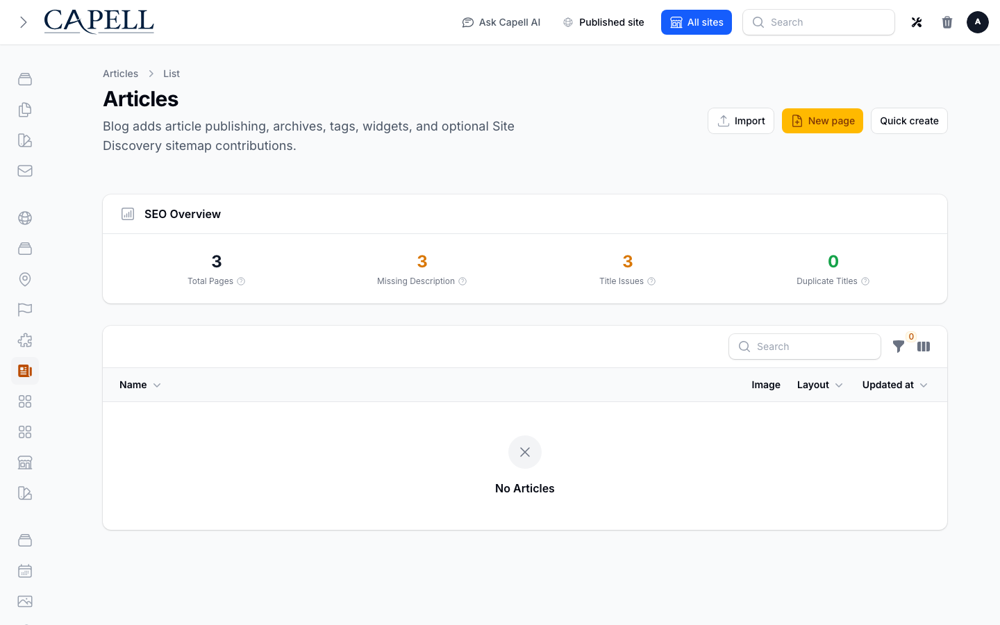
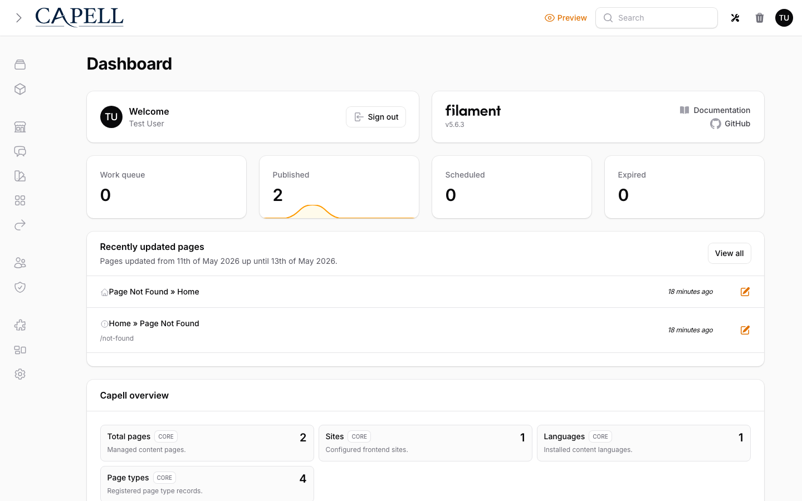

# Blog

<!-- prettier-ignore-start -->

## What This Plugin Adds

Blog is an **Available**, **Schema-owning** Capell package in the **Capell Publishing Pro** product group. It ships as `capell-app/blog` and extends these surfaces: admin, frontend, console.

Blog adds premium article publishing, archive pages, tag pages, article widgets, optional discovery and analytics bridges, and frontend Livewire page components to Capell.

After install, admins get package-owned management surfaces and public users may see package-owned frontend output or routes.

Status details:

- Status: Available
- Tier: premium
- Bundle: publishing-pro
- Composer package: `capell-app/blog`
- Namespace: `Capell\Blog`
- Theme key: not applicable

## Why It Matters

**For developers:** The package gives developers package-owned service providers, Actions, Data objects, models, Filament classes, and Blade views instead of pushing this behaviour into core or application code.

**For teams:** Publish articles, archives, tag pages, and related-article widgets with multilingual, multi-site output and optional growth bridges.

## Screens And Workflow

Screenshot contract: `docs/screenshots.json`.

- Articles admin index (admin, required).
- Create/edit article form (admin, required).
- Blog page frontend output (frontend, optional).
- Archive page frontend output (frontend, required).
- Tag page frontend output (frontend, required).

## Technical Shape

- Service providers: `Capell\Blog\Providers\ConsoleServiceProvider`, `Capell\Blog\Providers\BlogServiceProvider`, `Capell\Blog\Providers\AdminServiceProvider`, `Capell\Blog\Providers\FrontendServiceProvider`.
- Migrations: `packages/blog/database/migrations/2026_05_10_190842_01_create_articles_table.php`.
- Models: `Article`.
- Filament classes: `ArticleSelect`, `SettingsTab`, `TagsInput`, `ArticlePageConfigurator`, `ArticleWidgetConfigurator`, `RelatedWidgetConfigurator`, `ArticleResource`, `CreateArticle`, `EditArticle`, `ListArticles`, `ArticleForm`, `ArticlePagesTable`, `and 4 more`.
- Livewire components: `Archive`, `Blog`, `Tag`.
- Policies: `ArticlePolicy`.
- Listeners: `AddBlogPagesToNavigation`, `ArticleTranslationSavedListener`.
- Actions: `ApplyArchiveDateFilterAction`, `AssignExampleArticleImageAction`, `BuildArticleMetaDataAction`, `BuildBlogFeedXmlAction`, `BuildBlogResultsViewDataAction`, `BuildTagListingDataAction`, `ClearBlogContentCacheAction`, `ClearBlogTagCacheAction`, `CreateBlogHeroDemoContentAction`, `CreateBlogPagesAction`, `EnsureArticlePublishingDefaultsAction`, `EnsureBlogPublishingSurfaceAction`, `and 6 more`.
- Data objects: `ArchiveLinkData`, `ArchiveMonthData`, `ArticleMetaData`, `ArticleNeighborLinkData`, `ArticleWidgetRenderData`, `BlogPublishingSurfaceData`, `BlogResultItemData`, `BlogResultsViewData`, `BlogTagLinkData`, `BlogWidgetContentData`, `ArticleHealthData`, `LanguageCoverageData`, `and 6 more`.
- Command signatures: `capell:blog-demo`, `capell:blog-install`, `capell:blog-setup`.
- Console command classes: `CreateBlogPagesCommand`, `DemoCommand`, `FakerCommand`, `HeroDemoCommand`, `InstallCommand`, `SetupCommand`.
- Manifest contributions: `admin-resource: Capell\Blog\Manifest\BlogAdminResourcesContribution`, `configurator: Capell\Blog\Manifest\BlogConfiguratorsContribution`, `model: Capell\Blog\Manifest\BlogModelsContribution`, `page-type: Capell\Blog\Manifest\BlogPageTypesContribution`, `page-variation: Capell\Blog\Manifest\BlogPageTypesContribution`, `route: Capell\Blog\Manifest\BlogRoutesContribution`.
- Health checks: `Capell\Blog\Health\BlogHealthCheck`.
- Blade views: `packages/blog/resources/views/components/article-meta.blade.php`, `packages/blog/resources/views/components/asset-after-title.blade.php`, `packages/blog/resources/views/components/footer/pages.blade.php`, `packages/blog/resources/views/components/footer/tags.blade.php`, `packages/blog/resources/views/components/page/author.blade.php`, `packages/blog/resources/views/components/page/published-date.blade.php`, `packages/blog/resources/views/components/page/tags.blade.php`, `packages/blog/resources/views/components/tag.blade.php`, `packages/blog/resources/views/components/widget/page/archives.blade.php`, `packages/blog/resources/views/components/widget/page/article.blade.php`, `packages/blog/resources/views/components/widget/tag/tags.blade.php`, `packages/blog/resources/views/filament/widgets/article-health.blade.php`, `and 4 more`.
- Cache tags: `blog`.

## Data Model

- Required tables: `articles`.
- Models: `Article`.
- Migration files: `2026_05_10_190842_01_create_articles_table.php`.
- Migration impact: run host migrations through the package install flow before opening package surfaces.
- Deletion/retention behaviour: Docs gap unless the package has an explicit pruning command, retention setting, or tested cascade path.

## Install Impact

- Admin navigation: adds package-owned Filament classes when registered.
- Permissions: `article.view`, `article.create`, `article.update`, `article.delete`, `article.restore`, `article.force_delete`, `tag.view`, `tag.create`, `tag.update`, `tag.delete`, `tag.restore`, `tag.force_delete`.
- Public routes: none detected in package route files.
- Database changes: package migrations are declared.
- Settings: no package settings declared.
- Queues or schedules: none detected in standard package paths.
- Cache tags: `blog`.
- Commands: `capell:blog-demo`, `capell:blog-install`, `capell:blog-setup`.

## Common Pitfalls

- Run migrations before opening package resources or public routes.
- Keep public Blade and cached HTML free of authoring markers, model IDs, permissions, signed editor URLs, and lazy database queries.
- Run package commands from the host app; in this repository use `vendor/bin/pest` for package tests.
- Keep `composer.json`, `composer.local.json`, `capell.json`, docs, screenshots, and tests aligned when the package surface changes.

## Troubleshooting

| Symptom | Likely cause | Check | Fix |
| --- | --- | --- | --- |
| Package surface is missing after install | Provider or manifest is not loaded | Confirm `capell.json`, package `composer.json`, and provider registration | Reinstall the package, refresh Composer autoload, and clear host caches |
| Admin screen or command fails on missing table | Package migrations have not run | Check the tables listed in `Data Model` | Run host migrations and rerun the focused package test |
| Background work does not run | Queue worker or scheduled command is not active | Check package jobs, commands, and host scheduler configuration | Start the queue or scheduler, then run the focused command or package test |
| Public output leaks unexpected state | Render data, cache variation, or authoring boundary has regressed | Check public Blade, cache tags, and public-output safety tests | Move data loading out of Blade and rerun the package public-output tests |

## Quick Start

1. Install the package: `composer require capell-app/blog`.
2. Run the required setup: `php artisan capell:blog-setup`.
3. Open the related Capell admin surface and verify Blog appears.

## Next Steps

- [Package docs](docs/README.md)
- [Overview](docs/overview.md)
- [Screenshot contract](docs/screenshots.json)
- [Marketplace assets](docs/assets/marketplace/)
- [Capell content language plan](../../docs/CONTENT_LANGUAGE_PLAN.md)
- [Capell documentation design system](../../docs/DESIGN_SYSTEM.md)
- [Capell and package ERD notes](../../docs/erd/capell-and-package-erds.md)
- Related packages: [Content Sections](../content-sections/README.md), [Html Cache](../html-cache/README.md), [Layout Builder](../layout-builder/README.md), [Navigation](../navigation/README.md), [Tags](../tags/README.md), [Comments](../comments/README.md), [Insights](../insights/README.md), [Publishing Studio](../publishing-studio/README.md), [Site Discovery](../site-discovery/README.md), [Url Manager](../url-manager/README.md).
- Focused tests: `vendor/bin/pest packages/blog/tests --configuration=phpunit.xml`.

<!-- prettier-ignore-end -->
